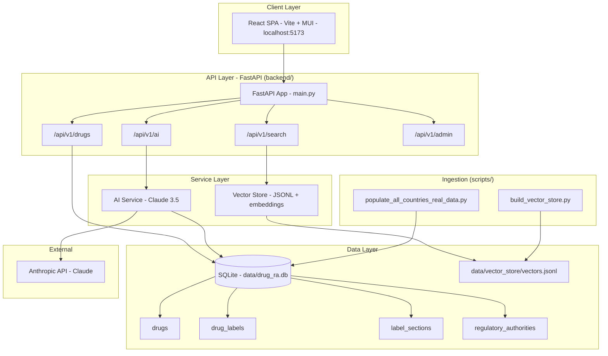
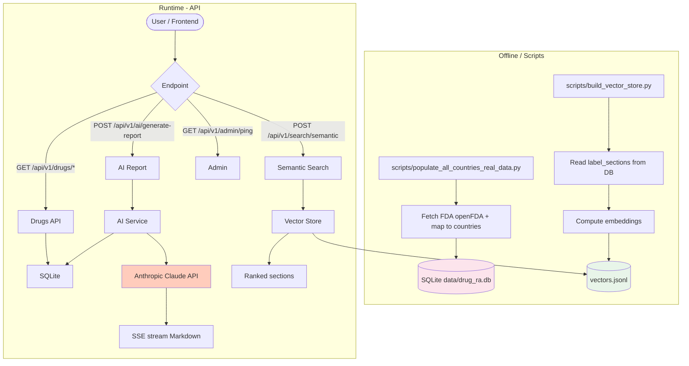
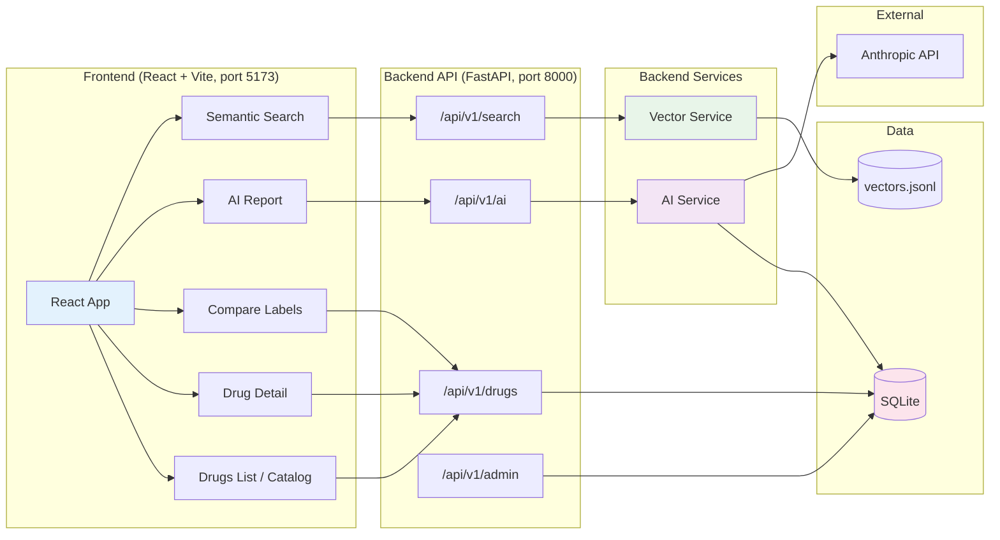
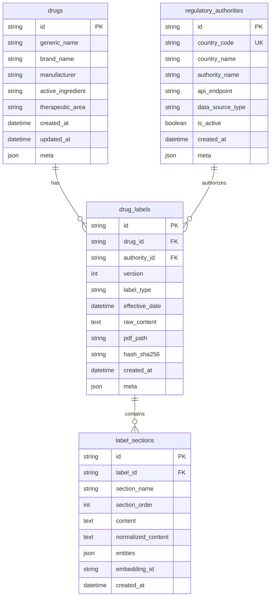
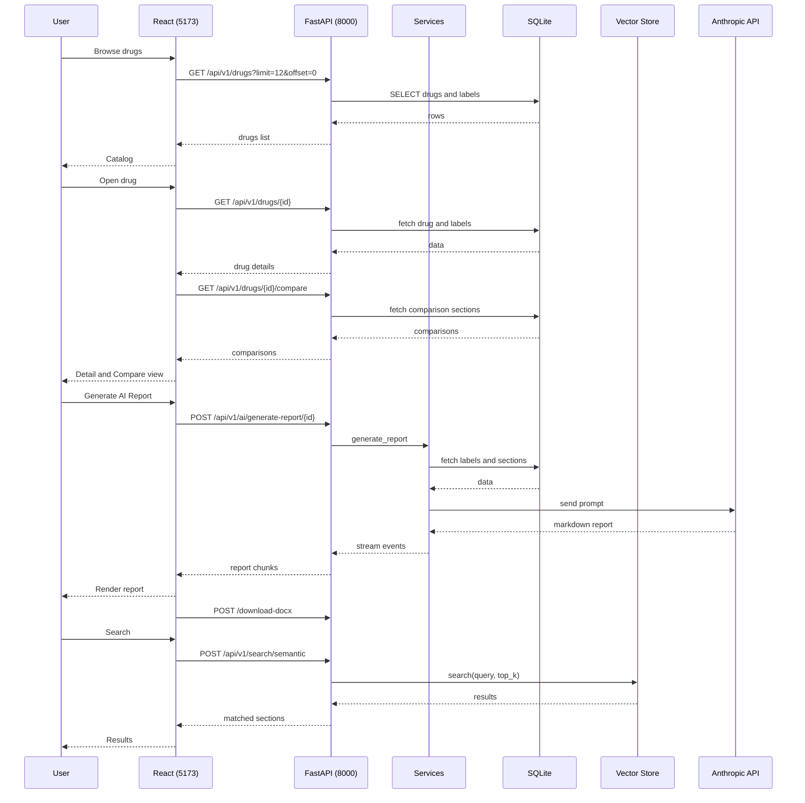

# NeuroNext Regulatory Intelligence

AI-Powered Cross-Country Drug Label Comparison & Regulatory Intelligence Platform

> Architecture diagrams use [Mermaid](https://mermaid.js.org/). They render on GitHub and in editors with Mermaid support (e.g. VS Code with Markdown Preview Mermaid Support).

## Table of Contents

- [Quick Setup](#quick-setup)
- [Overview](#overview)
- [Architecture](#architecture)

## Quick Setup

Get the project running in 5 minutes:

```bash
# 1. Clone the repository
git clone <your-repo-url>
cd drug-ra

# 2. Create virtual environment and install dependencies
python -m venv .venv
.venv\Scripts\activate  # Windows
# source .venv/bin/activate  # Linux/Mac

pip install -r requirements.txt

# 3. Set up environment variables
copy .env.example .env
# Edit .env and add your GOOGLE_API_KEY or ANTHROPIC_API_KEY
# Note: .env values will now override system environment variables for this project.

# 4. Initialize the database with real regulatory data
python scripts/fetch_and_store_real_data.py

# 5. Start the backend server
cd backend
python -m uvicorn main:app --host 0.0.0.0 --port 8000 --reload

# 6. In a new terminal, start the frontend
cd frontend
npm install
npm run dev
```

**Access the application:**
- Frontend: http://localhost:5173
- Backend API: http://localhost:8000
- API Docs: http://localhost:8000/docs

**That's it!** The database includes real regulatory data from:
- **US**: FDA openFDA API (23 drugs)
- **EU**: EMA EPAR (20 drugs)
- **GB**: UK EMC (9 drugs)

For detailed setup, see [Installation](#installation) below.
  - [System Architecture](#system-architecture)
  - [Data Flow](#data-flow)
  - [Component Diagram](#component-diagram)
  - [Database Schema](#database-schema)
  - [Request-Response Flow](#request-response-flow)
- [Features](#features)
- [Data Sources](#data-sources)
- [Quick Start](#quick-start)
- [Project Structure](#project-structure)
- [API Endpoints](#api-endpoints)
- [Usage](#usage)
- [Technology Stack](#technology-stack)

## Overview

This platform automatically collects, standardizes, and compares drug labels across multiple regulatory authorities (US FDA, Japan PMDA, India CDSCO, UK MHRA, Canada Health Canada) to detect discrepancies in dosage, indications, warnings, and safety information using AI-powered analysis.

## Architecture

### System Architecture


### Data Flow



### Component Diagram



### Database Schema

The app uses SQLite at `data/drug_ra.db`. The path is resolved from the project root so the same DB is used whether the server runs from `backend/` or project root.



Cross-country comparison is computed at request time from `drug_labels` and `label_sections` (no separate comparison tables). Semantic search uses `data/vector_store/vectors.jsonl` (embeddings of section content).

### Request-Response Flow



## Features

- **Multi-Country Drug Database**: Drugs and labels from US (FDA openFDA) with country-mapped section naming (US, EU, GB, CA, JP, AU)
- **AI-Powered Reports**: Google Gemini (primary) or Anthropic Claude (fallback) generates cross-country comparison reports; streamed via SSE
- **Intelligent Insights**: Strategic "Regulatory AI Insight" displayed on drug detail pages with Markdown-enhanced formatting for better readability
- **DOCX Export**: Download reports as Word documents (tables, headings, lists)
- **Semantic Search**: Search across label sections using vector similarity (embeddings in `data/vector_store/`)
- **Cross-Country Comparison**: Compare the same drug across authorities via `/api/v1/drugs/{id}/compare`
- **Modern Web UI**: React SPA (Vite + MUI) with React Query and Zustand

## Data Sources

### United States (US)
- **Authority**: U.S. Food and Drug Administration (FDA)
- **Data Source**: [openFDA API](https://open.fda.gov/)
- **Type**: Official REST API
- **Coverage**: Full drug label data with sections, indications, dosage, warnings

### Japan (JP)
- **Authority**: Pharmaceuticals and Medical Devices Agency (PMDA)
- **Data Source**: [PMDA Website](https://www.pmda.go.jp/) + PMDA Search System
- **Type**: Web Scraping (Package Inserts Database)
- **Coverage**: Real regulatory labels with Japanese-specific considerations
- **Access Method**: Web scraping of PMDA search and product detail pages

### India (IN)
- **Authority**: Central Drugs Standard Control Organization (CDSCO)
- **Data Source**: [CDSCO Portal](https://cdsco.gov.in/)
- **Type**: Web Scraping (Drug Approval System)
- **Coverage**: Real regulatory labels with Indian population considerations
- **Access Method**: Web scraping of CDSCO drug approval database

### United Kingdom (GB)
- **Authority**: Medicines and Healthcare products Regulatory Agency (MHRA)
- **Data Source**: [Electronic Medicines Compendium (EMC)](https://www.medicines.org.uk/emc)
- **Type**: Web Scraping (Summary of Product Characteristics - SmPC)
- **Coverage**: Real regulatory labels with UK-specific guidelines
- **Access Method**: EMC database scraping for SmPC documents

### Canada (CA)
- **Authority**: Health Canada
- **Data Source**: [Drug Product Database (DPD)](https://health-products.canada.ca/dpd-bdpp/)
- **Type**: Web Scraping (Product Monographs)
- **Coverage**: Real regulatory labels with bilingual requirements
- **Access Method**: Health Canada DPD web scraping

> **Note**: All data sources provide real regulatory data. The US uses the openFDA REST API, while other countries use targeted web scraping of official regulatory authority websites and databases. The platform is designed to respect rate limits and robots.txt directives.
>
> **Important**: When no data is found from an API or website for a particular drug/country combination, the system shows "No data found" instead of using mock or simulated data. Only real regulatory data from official sources is included in the platform.


## Quick Start

### Prerequisites

- Python 3.8+ (backend)
- Node.js 18+ (frontend)
- UV (recommended) or pip for Python

### Installation

```bash
# From project root (drug-ra/)
uv venv
# On Windows: .venv\Scripts\activate
# On Unix: source .venv/bin/activate
uv pip install -r backend/requirements.txt

# Frontend
cd frontend
npm install
cd ..
```

Copy `.env` to the project root (or create from `.env.example` if present) and set `ANTHROPIC_API_KEY` or `GLM_API_KEY` for AI reports. Optional: `DATABASE_URL` (defaults to project-root `data/drug_ra.db`), `CORS_ORIGINS` (default includes `http://localhost:5173`).

### Running the Application

**Backend (run from project root with venv activated):**

```bash
cd backend
uv run uvicorn main:app --host 0.0.0.0 --port 8000 --reload
```

**Frontend:**

```bash
cd frontend && npm run dev
```

- API: **http://localhost:8000**
- Frontend: **http://localhost:5173**

### Verify database has data

If the API returns empty drug lists, ensure the DB is populated. Run from **project root** (with venv activated):

```bash
uv run python scripts/check_db_data.py
```

If counts are zero, populate and optionally rebuild the vector store:

```bash
uv run python scripts/populate_all_countries_real_data.py
uv run python scripts/build_vector_store.py
```

## Project Structure

```
drug-ra/
├── backend/                      # FastAPI application
│   ├── main.py                   # App entry, lifespan, CORS, router includes
│   ├── requirements.txt         # Python dependencies
│   └── app/
│       ├── api/                  # Route modules
│       │   ├── drugs.py           # List, detail, stats, manufacturers, compare
│       │   ├── ai_reports.py     # SSE report generation, DOCX download, status
│       │   ├── search.py         # POST /semantic (vector search)
│       │   └── admin.py          # GET /ping
│       ├── core/
│       │   ├── config.py         # Settings, DATABASE_URL (resolved to project root)
│       │   └── database.py       # Async SQLite (aiosqlite), get_db
│       ├── models.py            # Drug, RegulatoryAuthority, DrugLabel, LabelSection
│       ├── schemas/             # Pydantic schemas (drugs, reports, comparisons)
│       └── services/
│           ├── ai_service.py    # Claude report generation
│           └── vector_service.py # Vector store (JSONL + embeddings)
│
├── frontend/                     # React SPA (Vite, port 5173)
│   ├── package.json
│   ├── index.html
│   └── src/                     # React components, pages, API client
│
├── scripts/                      # Data and tooling (run from project root)
│   ├── populate_all_countries_real_data.py  # Main DB population (FDA + country mapping)
│   ├── build_vector_store.py    # Build data/vector_store/ from DB
│   ├── check_db_data.py         # Verify DB path and row counts
│   ├── main.py                  # Legacy/alternate ingestion
│   ├── query.py                 # CLI query
│   └── ...                      # Other ingest/validation scripts
│
├── data/                         # Runtime data (project root)
│   ├── drug_ra.db               # SQLite database
│   └── vector_store/            # vectors.jsonl for semantic search
│
├── .env                          # ANTHROPIC_API_KEY, DATABASE_URL, CORS_ORIGINS, etc.
├── requirements.txt             # Root-level deps (if used)
└── README.md
```

### Key Components

| Component | Description |
|-----------|-------------|
| **backend/main.py** | FastAPI app; mounts drugs, ai_reports, search, admin; lifespan creates tables and loads vector store |
| **backend/app/core/config.py** | `DATABASE_URL` resolved to project-root `data/drug_ra.db` so one DB is used regardless of cwd |
| **backend/app/api/drugs.py** | List (with filters), detail, stats, manufacturers, compare; DATA_SOURCES map for country metadata |
| **backend/app/api/ai_reports.py** | SSE stream for report generation; DOCX download; AI status |
| **backend/app/services/ai_service.py** | Fetches drug + labels from DB, calls Anthropic Claude, returns Markdown |
| **backend/app/services/vector_service.py** | Loads/saves vectors from `data/vector_store/vectors.jsonl`; cosine search over section embeddings |
| **scripts/populate_all_countries_real_data.py** | Populates SQLite from FDA and maps sections to country naming |
| **scripts/check_db_data.py** | Prints which DB file(s) exist and row counts for drugs, labels, sections, authorities |

## API Endpoints

Backend serves JSON (and SSE for reports). The React frontend (port 5173) consumes these; CORS allows `http://localhost:5173`.

### Root
- `GET /` - Health/info: `{ name, version, status }`

### Drugs (`/api/v1/drugs`)
- `GET /api/v1/drugs/` - List drugs (query: `limit`, `offset`, `search`, `manufacturer`, `country`). Response: `{ drugs, total, limit, offset }`
- `GET /api/v1/drugs/stats` - Counts: `{ drugs, labels, sections, countries }`
- `GET /api/v1/drugs/manufacturers` - Distinct manufacturers: `{ manufacturers }`
- `GET /api/v1/drugs/{drug_id}` - Drug detail with labels and sections
- `GET /api/v1/drugs/{drug_id}/compare` - Compare labels by section heading across countries

### AI Reports (`/api/v1/ai`)
- `POST /api/v1/ai/generate-report/{drug_id}` - SSE stream: status events and final `report` (Markdown)
- `POST /api/v1/ai/download-docx/{drug_id}` - Body: `{ report }`. Returns DOCX file
- `GET /api/v1/ai/status` - AI availability: `{ status, available, provider? }`

### Search (`/api/v1/search`)
- `POST /api/v1/search/semantic` - Body: `{ query, top_k? }`. Returns ranked sections: `section_id`, `label_id`, `drug_id`, `country_code`, `heading`, `content`

### Admin (`/api/v1/admin`)
- `GET /api/v1/admin/ping` - `{ status: "ok" }`

## Environment Variables

Configure via `.env` at the project root. The backend loads it; `DATABASE_URL` is resolved to the project-root DB when set to the default relative path. **Note: Local `.env` values override system environment variables.**

```ini
# Required for AI report generation (use at least one)
GOOGLE_API_KEY=your_gemini_key_here
ANTHROPIC_API_KEY=your_anthropic_key_here

# Optional: AI Model Selection
GOOGLE_MODEL=gemini-2.5-flash
ANTHROPIC_MODEL=claude-3-haiku-20240307

# Optional: defaults to project-root data/drug_ra.db
DATABASE_URL=sqlite+aiosqlite:///./data/drug_ra.db
```

# Optional: API server
API_HOST=0.0.0.0
API_PORT=8000

# Optional: CORS (comma-separated)
CORS_ORIGINS=http://localhost:5173

# Optional: logging and debug
DEBUG=true
LOG_LEVEL=INFO

# Optional: vector store path
VECTOR_STORE_PATH=data/vector_store
```

## Data Collection

Data is populated by scripts (run from project root with venv activated). There is no ingestion API endpoint.

```bash
# Main population: FDA openFDA data mapped to country-specific section names (US, EU, GB, CA, JP, AU)
uv run python scripts/populate_all_countries_real_data.py

# Rebuild vector store for semantic search (uses label_sections from DB)
uv run python scripts/build_vector_store.py

# Verify DB has data (checks data/drug_ra.db and backend/data/drug_ra.db)
uv run python scripts/check_db_data.py
```

## Usage

### 1. Browse Drugs
- Open the frontend at http://localhost:5173 (API at http://localhost:8000)
- Browse the drug catalog (list from `/api/v1/drugs/`)
- Click a drug to view detail and labels by country

### 2. Generate AI Report
- From a drug detail view, trigger "Generate AI Report"
- Frontend opens SSE to `POST /api/v1/ai/generate-report/{id}` and displays streamed Markdown
- Use "Download DOCX" to get a Word file via `POST /api/v1/ai/download-docx/{id}` with the report body

### 3. Cross-Country Comparison
- On a drug page, use the compare view; data comes from `GET /api/v1/drugs/{id}/compare`
- Sections are grouped by heading with content per country
- See highlighted discrepancies

### 4. Semantic Search
- Use the Search page; queries hit `POST /api/v1/search/semantic`
- Results are label sections ranked by embedding similarity (vector store from `data/vector_store/vectors.jsonl`)

## AI Report Features

The AI-generated reports and insights (Gemini/Claude) include:
- **Strategic Intelligence**: Automated "Regulatory AI Insight" summary on drug detail pages with Markdown support (bolding, lists).
- **Executive Summary**: High-level cross-country comparison and key findings.
- **Discrepancy Detection**: Analysis of mismatches between jurisdictions with severity levels.
- **Compliance Recommendations**: Actionable steps for regulatory alignment.
- **Multi-Format Output**: Markdown output streamed via SSE; professional DOCX export.

## Technology Stack

- **Backend**: FastAPI, SQLAlchemy 2.0 (async), aiosqlite, Pydantic Settings
- **Frontend**: React 18, Vite, Tailwind CSS (with Typography), Lucide Icons, React Markdown
- **AI**: Google Gemini (Primary), Anthropic Claude (Fallback)
- **Database**: SQLite at `data/drug_ra.db` (path resolved from project root)
- **Search**: In-memory vector store over JSONL embeddings (cosine similarity)
- **Documents**: python-docx for DOCX export

## Contributing

1. Fork the repository
2. Create a feature branch (`git checkout -b feature/amazing-feature`)
3. Commit your changes (`git commit -m 'Add amazing feature'`)
4. Push to the branch (`git push origin feature/amazing-feature`)
5. Open a Pull Request

## License

MIT License - feel free to use and modify for your needs.

## Support

For issues, questions, or suggestions:
- Open an issue on GitHub
- Email: support@example.com

---

**Built with care for pharmaceutical regulatory intelligence**

